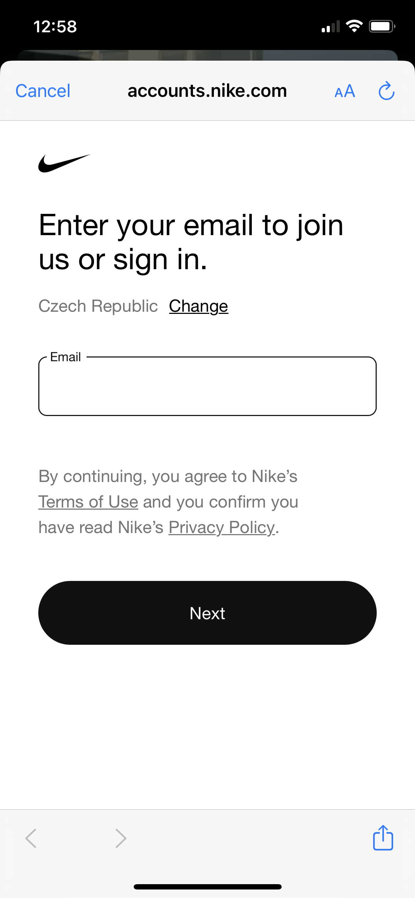

# 📪 Vytvoření účtu

## Krok 1 - Stáhnout si aplikace NIKE A SNKRS

Jako první krok je třeba si stáhnout tyhle dvě appky.&#x20;

<figure><figcaption></figcaption></figure>

## Krok 2 - Založení účtu

V aplikaci dejte zaregistrovat, napište svůj email

&#x20;

Na email přijde kód k ověření, vyplnit zbytek a jít dál

Účet je z půlky ready, teď je třeba ověřit číslo

Klasicky ověření čísla

Teď už jen stačí zadat svoji adresu a platební metodu. Nejlepší metoda je ApplePay, který jde vybrat při nákupu. Je to nejrychlejší a nejjednodušší. Paypal je taky good, ale musíte se přihlašovat každý drop. Takže buď ApplePay nebo klasicky kartu. Peníze se strhávají v eurech, takže nejlepší mít Eur účet.&#x20;

Dodací adresa je easy. Hlavně tam dejte tel.číslo, ať se kurýr dovolá. Balíky vozí UPS a skoro vždy volají předem.&#x20;

